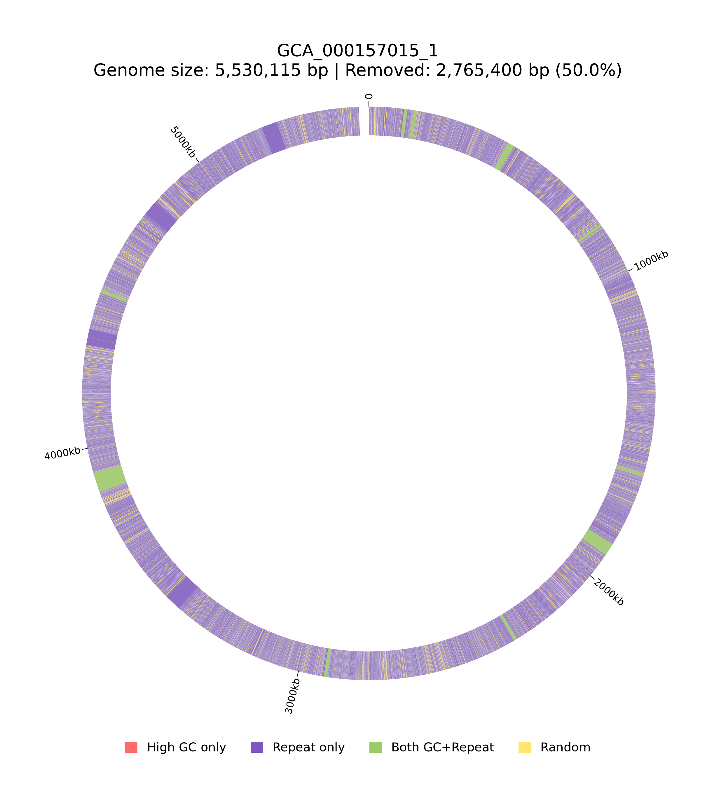

# Genome Quality Simulation

A Python-based tool for simulating realistic draft bacterial genomes in two complementary ways:

- Reduce sequence content to a target completeness
- Fragment a complete genome to a target contig N50 while preserving 100% completeness

Both modes prioritize biologically difficult regions such as high-GC segments and repetitive DNA so the resulting assemblies remain biased in realistic ways rather than being purely random.

## Overview

Draft genome assemblies can fail in at least two distinct ways: they can be incomplete, and they can be highly fragmented even when nearly complete. This tool models both behaviors by focusing on genomic regions that are typically challenging to assemble:

- **High GC content regions**: Difficult to sequence and assemble
- **Repetitive sequences**: Detected using [Red](https://github.com/BioinformaticsToolsmith/Red) (REpeat Detector)
- **Self-homology breakpoints**: Optionally complemented with `nucmer` self-alignment evidence
- **Random fragments / breakpoints**: Used only when needed to match the requested target

The tool generates simulated draft genomes plus detailed reports and optional visualizations showing which regions were removed or where breakpoints were placed.

## Features

- **Intelligent region selection**: Prioritizes removal of biologically challenging regions
- **Repeat detection**: Uses Red for accurate identification of repetitive elements
- **N50 fragmentation mode**: Places assembly-like breakpoints to hit a target contig N50
- **Breakpoint jitter**: Adds realistic positional noise around candidate breakpoints
- **Minimum contig size enforcement**: Avoids generating unrealistically tiny contigs in N50 mode
- **Optional nucmer support**: Can augment Red with exact/near-exact self-homology evidence
- **Large genome support**: Automatically fragments large contigs for efficient processing
- **Circular visualization**: Generates publication-quality circular genome plots
- **Detailed reporting**: Comprehensive statistics and region-by-region analysis
- **Reproducible**: Seed-based random number generation for consistent results

## Installation

This project uses [Pixi](https://pixi.sh/) for dependency management, which provides a reproducible environment with all required dependencies including Python packages and the Red repeat detector.

### Prerequisites

Install Pixi (if not already installed):

```bash
# Linux/macOS
curl -fsSL https://pixi.sh/install.sh | bash

# Windows PowerShell
iwr -useb https://pixi.sh/install.ps1 | iex
```

### Quick Start

```bash
# Clone the repository
git clone https://github.com/lorenzooaureli/Genome-quality-simulation.git
cd Genome-quality-simulation

# Install all dependencies automatically
pixi install

# Verify Red is installed correctly
pixi run check-red
```

That's it! Pixi will automatically install:
- Python (≥3.8)
- BioPython (≥1.79)
- NumPy (≥1.20)
- Matplotlib (≥3.3)
- pyCirclize (≥0.3.0)
- MUMmer (`nucmer`, `show-coords`)
- Red (repeat detector) on `linux-64` and `osx-64`

Apple Silicon note:
- Bioconda currently does not provide `red` for `osx-arm64`
- On `osx-arm64`, Pixi still solves and installs the rest of the environment
- The script will skip Red-based repeat detection automatically if `Red` is unavailable
- `mummer` is installed across all supported platforms, so `--use-nucmer` remains available

### Development Environment

For development work (linting, formatting, testing):

```bash
# Install with development dependencies
pixi install --environment dev

# Run in dev environment
pixi run -e dev format  # Format code with Black
pixi run -e dev lint    # Lint code with Flake8
pixi run -e dev test    # Run tests with pytest
```

## Usage

### Quick Examples

Run predefined example simulations:

```bash
# Basic simulation (50% completeness, no visualization)
pixi run example-basic

# Simulation with circular visualization PDF
pixi run example-with-viz

# Fragment the complete genome to a target N50
pixi run example-n50

# Fragment and save a contig-length plot
pixi run example-n50-plot
```

### Basic Usage

```bash
# Using pixi tasks (recommended)
pixi run simulate --input <input.fna> \
  --output <output.fna> \
  --completeness 0.5 \
  --seed 42

# Or fragment to a target N50 while preserving 100% completeness
pixi run simulate --input <input.fna> \
  --output <output.fna> \
  --target-n50 50000 \
  --min-contig-size 500 \
  --n50-plot contig_lengths.pdf \
  --seed 42

# Or activate the environment first
pixi shell
python simulate_dna_completeness.py \
  --input <input.fna> \
  --output <output.fna> \
  --completeness 0.5 \
  --seed 42
```

Each run also writes a JSON file with simple contig statistics by default:

```text
<output>.stats.json
```

You can override that location with `--stats-json`.

### With Visualization

```bash
pixi run simulate --input GCA_000157015_1.fna \
  --output example_50_output.fna \
  --completeness 0.5 \
  --vis_log simulation_report.txt \
  --seed 42
```

This example uses the provided `GCA_000157015_1.fna` as input and generates `example_50_output.fna` as the output with 50% target completeness.

### N50 Fragmentation Example

```bash
pixi run simulate --input GCA_000157015_1.fna \
  --output example_n50_output.fna \
  --target-n50 50000 \
  --min-contig-size 500 \
  --breakpoint-jitter 100 \
  --n50-plot example_n50_lengths.pdf \
  --seed 42
```

This keeps the genome fully complete, but introduces biologically-motivated breakpoints until the resulting contig set approaches the requested N50.
The contig-length plot is a horizontal bar chart sorted from longest to shortest, with the N50-defining contig highlighted and target/actual N50 markers overlaid.
If `--target-n50` exceeds the current input assembly N50, the tool now returns the input assembly unchanged instead of failing.

### Available Pixi Tasks

The `pixi.toml` file defines several convenient tasks:

| Task | Description |
|------|-------------|
| `pixi run simulate` | Run the main simulation script |
| `pixi run example-basic` | Run basic example simulation (50% completeness) |
| `pixi run example-with-viz` | Run example with visualization |
| `pixi run example-n50` | Run example N50 fragmentation simulation |
| `pixi run example-n50-plot` | Run example N50 simulation and save the contig-length plot |
| `pixi run help` | Show command-line help |
| `pixi run check-red` | Verify Red installation |
| `pixi run check-nucmer` | Verify optional nucmer/show-coords availability |
| `pixi run clean` | Remove generated output files |

**Development tasks** (requires dev environment):
| Task | Description |
|------|-------------|
| `pixi run -e dev format` | Format code with Black |
| `pixi run -e dev lint` | Lint code with Flake8 |
| `pixi run -e dev test` | Run tests with pytest |

### Command-Line Options

| Option | Description | Default |
|--------|-------------|---------|
| `--input` | Path to complete genome FASTA file (required) | - |
| `--output` | Path for output draft genome FASTA (required) | - |
| `--completeness` | Target completeness (0-1 or 0-100 for percentage) | - |
| `--target-n50` | Target output contig N50 in bp (mutually exclusive with `--completeness`) | - |
| `--seed` | Random seed for reproducibility | 42 |
| `--num_threads` | Number of threads for Red | 8 |
| `--max_contig_size` | Maximum contig size before fragmentation (bp) | 1,000,000 |
| `--fragment_size` | Fragment size for large contigs (bp) | 500,000 |
| `--overlap` | Overlap between fragments (bp) | 50,000 |
| `--min-contig-size` | Minimum contig size enforced in `--target-n50` mode (bp) | 500 |
| `--breakpoint-jitter` | Maximum absolute Gaussian breakpoint jitter in `--target-n50` mode (bp) | 100 |
| `--use-nucmer` | Augment Red repeat detection with nucmer self-alignment evidence | off |
| `--nucmer-min-identity` | Minimum percent identity for nucmer self-homology intervals | 95.0 |
| `--nucmer-min-length` | Minimum alignment length for nucmer self-homology intervals (bp) | 500 |
| `--log` | Path to text log file (report only) | - |
| `--vis_log` | Path to log file with PDF visualization | - |
| `--n50-plot` | Path to contig-length plot for `--target-n50` mode | - |
| `--stats-json` | Path to JSON file with output contig statistics | `<output>.stats.json` |

## Example Output

The tool generates a circular visualization showing the genomic regions that were removed during simulation:



**Legend:**
- **Red**: High GC content regions only
- **Purple**: Repetitive regions only
- **Green**: Regions with both high GC and repeats
- **Yellow**: Randomly selected regions

In this example, a 5.5 Mbp genome was reduced to 50% completeness by removing 2.76 Mbp distributed across the genome based on the region characteristics.

## How It Works

1. **GC Content Analysis**: The genome is divided into windows, and regions with unusually high GC content (mean + 2σ) are identified

2. **Repeat Detection**: Red analyzes the genome to identify repetitive sequences
   - Large contigs are automatically fragmented for efficient processing
   - Coordinates are properly mapped back to the original genome
   - Optional `nucmer` self-alignment can add exact and near-exact self-homology evidence

3. **Region Prioritization**: Regions are categorized and prioritized:
   - Highest priority: Regions with both high GC and repeats
   - Medium priority: High GC regions only
   - Medium priority: Repeat regions only
   - Lowest priority: Random regions / random breakpoints when needed to match the requested target

4. **Simulation Mode**:
   - `--completeness`: Regions are removed according to priority until target completeness is achieved
   - `--target-n50`: Breakpoints are placed at prioritized region boundaries until the output contig set approaches the requested N50

5. **Output Generation**:
   - Draft genome FASTA with remaining fragments
   - Detailed report with statistics
   - Circular visualization (if requested)

## Output Files

### Draft Genome FASTA

Contains the simulated draft genome as multiple contigs (fragments):

```
>genome_frag_1
ATGCGATCG...
>genome_frag_2
GCTAGCTA...
```

### Report File

Detailed statistics including:
- Removal statistics by category
- Breakpoint statistics by category in N50 mode
- Region distribution analysis
- List of all removed regions with coordinates
- List of breakpoints and contig sizes in N50 mode
- Actual vs. target completeness
- Actual vs. target N50

### Visualization PDF

Circular genome plot showing:
- Genome structure
- Removed regions color-coded by category
- Statistics and legend

## Algorithm Details

### Coordinate Mapping

The tool implements proper coordinate mapping when processing fragmented genomes:
- Maintains mapping between fragment coordinates and original genome positions
- Ensures accurate repeat region identification across fragment boundaries
- Properly handles overlapping fragments

### Region Merging

Overlapping regions within each category are merged to prevent:
- Double-counting of removed bases
- Coordinate conflicts
- Inaccurate statistics

## Performance Considerations

- **Small genomes** (< 10 Mbp): Fast processing without fragmentation
- **Large genomes**: Automatic contig fragmentation for efficient Red processing
- **Memory usage**: Proportional to genome size
- **Threading**: Red supports multi-threading for faster repeat detection

## Citation

If you use this tool in your research, please cite:

- **Red**: Girgis, H. Z. (2015). Red: an intelligent, rapid, accurate tool for detecting repeats de-novo on the genomic scale. *BMC Bioinformatics*, 16(1), 227.

## License

This project is provided as-is for academic and research purposes.

## Author

This tool was developed for genome assembly simulation and benchmarking studies.

## Pixi Configuration

The `pixi.toml` file manages all dependencies and tasks for this project:

### Main Dependencies

- **Python** ≥3.8, <4
- **biopython** ≥1.79 - DNA sequence manipulation
- **numpy** ≥1.20 - Numerical operations
- **matplotlib** ≥3.3 - Plotting and visualization
- **pycirclize** ≥0.3.0 - Circular genome plots
- **red** - Repeat element detector (from bioconda)

### Development Dependencies (Optional)

Install with `pixi install --environment dev`:

- **pytest** ≥7.0 - Testing framework
- **black** ≥22.0 - Code formatter
- **flake8** ≥5.0 - Code linter
- **ipython** ≥8.0 - Interactive Python shell

### Cross-Platform Support

The pixi configuration supports:
- Linux (x86_64)
- macOS Intel (x86_64)
- macOS Apple Silicon (ARM64)

Windows users should use WSL2 (Windows Subsystem for Linux).

## Troubleshooting

### Red Installation Issues

If Red is not found after pixi installation:
```bash
# Check if Red is available
pixi run check-red

# Try reinstalling
pixi install --force-reinstall
```

### Pixi Environment Issues

If you encounter environment issues:
```bash
# Clean and reinstall
rm -rf .pixi
pixi install
```

### Memory Errors

For very large genomes, adjust fragmentation parameters:
```bash
pixi run simulate --input large_genome.fna \
  --output output.fna \
  --max_contig_size 500000 \
  --fragment_size 250000 \
  --completeness 0.5
```

### Visualization Errors

If visualization fails, ensure all dependencies are installed:
```bash
# Verify installation
pixi list

# Reinstall if needed
pixi install --force-reinstall
```

## Acknowledgments

This tool uses the Red repeat detector developed by the Bioinformatics Toolsmith team.
